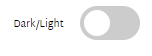

# Johnpooch.dog

### Project Goals
This site was created for my good friend, John McDowell, to use as a platform to post articles on subjects he is passionate about in the world of tech.

## Live Instance

The live instance of this site can be found [here.](http://johnpooch.dog/)

## Overview

Johnpooch.dog is a blog website created using the Django framework. The styling of this website are based on the zen style of [Medium.](https://medium.com/) The structure and features are that of a typical blog website other than some extra features I've had to add in for correct funtionality of the site.

This website will be a place to read about all the languages, frameworks and technologies that John is interested in as a developer.

# User Experience (UX)

## Strategy

* User Goals
    * As a user, I want to be able to browse various articles on the site
    * As a user, I want an appealing and easy to navigate site

* Site Owner Goals 
    * As site owner, I want the site to be accessible and responsive to allow users on all devices to be able to browse the site
    * As site owner, I want the site to have interesting and engaging articles to build up an audience
    

## User Stories

* First Time Visitor 
    * As a first time visitor, I want to understand the main purpose of the site, so that I can determine whether I wish to continue to browse or not.
    * As a first time visitor, I want to see an appealing and easy to navigate site, so that my browsing is enjoyable and pleasant to look at.
    * As a first time visitor, I expect the site to be accessible to all devices, so that I can browse the site across all my devices.
    * As a first time visitor, I want to easily register for an account, so that i can avail of the features only available to registered users.

* Unregistered Visitor
    * As an unregistered visitor, I want to be able to view all articles that are available for me to read, so that I can decide which article I would like to read.
    * As an unregistered visitor, I want to be able to select individual articles, so that I can read them.

* Registered Visitor
    * As a registered visitor, I want to be able to log in and log out, so that I can gain access to registered user features and log out when I am done browsing.
    * As a registered visitor, I want to be able to comment under individual articles, so that I can share my thoughts on the article.
    * As a registered visitor, I want to be able to edit any comments I have posted, so that I can fix any mistakes i've made.
    * As a registered visitor, I want to be able to delete any comments I have posted, so that I can delete any comments I don't want posted any longer.
    * As a registered visitor, I want to be able to easily follow the author on GitHub and LinkedIn, so that I can keep up to date with the things they are working on.
    * As a registered visitor, I want to be able to change my password if I forget it, so that I can continue to use the site.
    * As a registered visitor, I want to receive feedback that my comment is awaiting approval, so I know that my posting was successful.

* Superuser
    * As a superuser, I want to be able to add, delete or edit articles, so that I have full control over the content on the site.
    * As a superuser, I want to be able to approve and delete comments posted by registered users, so that I can moderate the comments that users are putting under the posts.
    * As a superuser, I want to be able to delete a user, so that I have full control over who is using the site.
    * As a superuser, I want to be able to edit and delete tags, so that I have full control over the tags being used on the posts.
    * As a superuser, I want to have to ability to give give other users admin status, so that I can give trusted users the ability to moderate the site.
    
User stories have also been recorded using GitHub issues and have been placed in the milsetone section under a 'Product Backlog' title. They can be seen [here.](https://github.com/mlenahan/Johnpooch.dog/milestone/1)

# Features

## Existing Features

- __The landing page__

    

    - The landing page of this site is a simple one consisting of all the articles that have been written. What you will see is the image and an excerpt from the article.

- __The nav bar__

    

    - This site has a simple navbar consisting of site title which acts as a home button and depending on whether you're logged in or not, a login and register button or a logout button.
    - This is featured across all pages.

- __The footer__

    

    - This site has a simple footer consisting of social media links to John's LinkedIn and GitHub.
    - This is featured across all pages.

- __The About__

    

    - The about section is a small and concise piece about who John is and what he is interested in and what you may see feature on the blog.

- __The comment section__

    

    - The site features a comment section that allows registered users to comment on the various posts on the site

    

    - Once a registered user has posted a comment, they will be given feedback to show that the comment has been sent for moderation. Comments have to be approved by an admin to avoid inapropriate or unwanted comments.

    

    - Once the comment has been approved, it will be visible under the post on which it was posted.

- __Custom gist and code snippets__

    

    

    - This site uses [Django Summernote](https://github.com/summernote/django-summernote) which provides WYSIWYG editor for creating and editing blog posts. By default, Django Summernote escapes all HTML tags. This meant that embedding Gist scripts would not work as expected. To work around this, I wrote a function using the Regex library that looks for escaped gist scripts and replaces them with un-escaped script tags. Additionally, inline code-snippets are commonly added using back-ticks ("`code snippet`"). This behaviour is not natively supported by Django Summernote. To achieve this behaviour, the `parsed_content` method also replaces back-ticks with `` tags that can be targeted in CSS to make them appear as code snippets. [Link to code.](https://github.com/mlenahan/ms4-django/blob/aa217116894a66741eeb9d2629f77b59cb40c5dd/blog/models.py#L48)

- __Authorisation__

    

    - The site currently allows users to register for an account. Registering for an account will let users comment on individual articles.

    

    - Registered users can sign into their accounts at this page. They can also sign out.

    

    - If a user has forgotten their password, they can reset it here.

    

    - Users will recieve confirmation that an email has been sent to them for resetting their password.

- __Dark mode toggle__

    - This site has the option of toggling dark mode on and off. I have implemented it by adding a sliding button in the top right of the page. By clicking this button, users can toggle between light and dark modes depending on their preferences.

    - I implemented the `localStorage` property in the script meaning the setting the user has selected will be stored in the browser. The next time they visit the site, the mode they selected will still be applied.

    The site in light mode can be seen here.

    

    The site in dark mode can be seen here.

    

    The toggle in dark mode can be seen here.

    

    The toggle in light mode can be seen here.

    

- __Share button__

    

    - This site features a share button on each post page. This was implemented using the `naviagator.share` method of the [Web Share API](https://developer.mozilla.org/en-US/docs/Web/API/Web_Share_API).

    - The `navigator.share()` method invokes the native sharing mechanism of the underlying operating system and passes the specified data.

    - This feature only works for sites that have end-to-end encryption and currently this site does not have end-to-end encryption so the fallback message will always be triggered if you click the share button. 

    - To enabe this feature I will need to upgrade to paid dynos on Heroku and configure Heroku SSL.

## Features to implement

- __Email post notifications__

    - In the future, I would love to implement a feature that sends all registered users an email when a new article is posted. This would be a great way of letting all registered users know that a new article has been posted.

- __Password reset__

    - Currently the password reset function doesn't actually send and email to reset your password so this is a feature I defintely want to add in the future.
    

# Design

## Skeleton

Wireframes were created on Balsamiq (see links below)

* [Mobile](media/wireframes/mobile_wireframes/ms4-mobile-bals.pdf)
* [Tablet](media/wireframes/tablet_wireframes/ms4-tablet-bals.pdf)
* [Desktop](media/wireframes/desktop_wireframes/ms4-desktop-bals.pdf)

- __Colour Scheme__

    - As this is a blog site, I decided to use a simple monochromatic colour scheme. This creates a harmonious, visually cohesive look. It doesn't draw attention to itself and lets the content shine.

 - __Typography__

    - I used [Google Fonts](https://fonts.google.com/) to import the fonts used for this site. I decided to use 'Martel Sans' as the primary font and 'Lora' as the secondary font.

- __Imagery__

    - All imagery for each article will be set by the author of the articles.

- __Design Choices__

    - The overall look and styling of this site is based on the zen styling of [Medium](https://medium.com/). I love reading articles on Medium and really enjoy the way they display their content so I took inspiration from this and applied it to my site.

# Technologies

## Languages Used

-   [HTML5](https://en.wikipedia.org/wiki/HTML5)
-   [CSS3](https://en.wikipedia.org/wiki/Cascading_Style_Sheets)
-   [JavaScript](https://en.wikipedia.org/wiki/JavaScript)
-   [Python](https://en.wikipedia.org/wiki/Python_(programming_language))

### Frameworks, Libraries and Programs Used

1. [Google Fonts](https://fonts.google.com/)
2. [Font Awesome](https://fontawesome.com/)
3. [Git](https://git-scm.com/)
4. [GitHub](https://github.com/)
5. [Gitpod](https://www.gitpod.io/)
6. [Chrome devtools](https://developer.chrome.com/docs/devtools/)
7. [Heroku](https://dashboard.heroku.com/apps)
8. [Postgres](https://www.postgresql.org/)
9. [Django](https://www.djangoproject.com/)
10. [Autopep8](https://pypi.org/project/autopep8/)
11. [Django Summernote](https://github.com/summernote/django-summernote)
12. [Re](https://docs.python.org/3/library/re.html)

# Testing

Testing and results can be found [here](TESTING.md)

# Deployment

## Fork

- To fork this project, go to my [repository](https://github.com/mlenahan/Johnpooch.dog).

- Click the fork option displayed below.

- The fork should now be in your repositories.

## Clone

- If someone wishes to clone the [repository](https://github.com/mlenahan/Johnpooch.dog), they can do so by using this command in their terminal/command line `git clone https://github.com/mlenahan/Johnpooch.dog.git`

- To install requirements, the user can use this command in their terminal/command line `pip3 install -r requirements.txt`

## Heroku

- Log in to Heroku, click 'New' and select 'Create New App'. In window give the app a name and choose region closest to you and then click 'Create App'. Then in Resources under Add-ons, select Heroku Postgres.

- In new app page select settings from menu, click reveal config vars. I added the config vars displayed below.

- Select 'Deploy' from menu. I chose to use GitHub to deploy my site. To do so, you search for your repo and select it. You then click the 'deploy branch' option. Heroku will deploy the repo for you automatically.

- You can also select automatic deployment to ensure heroku will deploy new versions of the project as you update it.

- You will need to run migrations in the heroku CLI if you make any changes to the models in your project.

# Credits

- Code Institute for walk through project 'I Think Therefore I Blog' and their GitPod template.

- StackOverflow for helping me troubleshoot issues I encountered and providing code snippets I could modify to use in my project.

- [Kevin Powell](https://www.youtube.com/kepowob) for the tutorial on dark mode.

- My good friend, [John McDowell](https://www.linkedin.com/in/john-mcdowell-b9882b9b/). He suggested the idea for the project to me. He told me he needed a blog site to post his articles and thought it would be the perfect portfolio project. All content and articles on the site are written by John.

